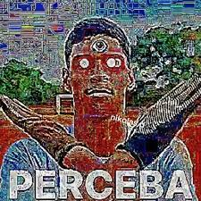

## Vírus Perceba
it's an executable file that passes itself off as a roblox gift code generator

> [!WARNING]
> THIS CODE IS VERY BAD, so make a pull request or an issue to improve it.

## Requirements
- **Python**
    - is the programming language used to make this virus.
- **PyYaml**
    - is used to get the characters to make the fake code.
- **Pillow**
    - Used to add Robux image
> [!NOTE]
> execute this ```pip install -r requirements.txt``` in the CMD

## PERCEBA
> [!WARNING]
> By pressing the program button, it will create several images on your desktop and change the wallpaper.



## Customizing
to customize look at the config file
```python
# Here you can configure Virus
# have fun modifying

image = "res/img/cache/perceba" # Image Path
extension = "jpeg" # Image Extension

complete = f'{image}.{extension}' #  image + extension = image.extension

def fileIN(i):
    imgvirus = 'YOUR IP' # Name of the image to be created on the desktop
    return f'{imgvirus} ({i}).{extension}'
```